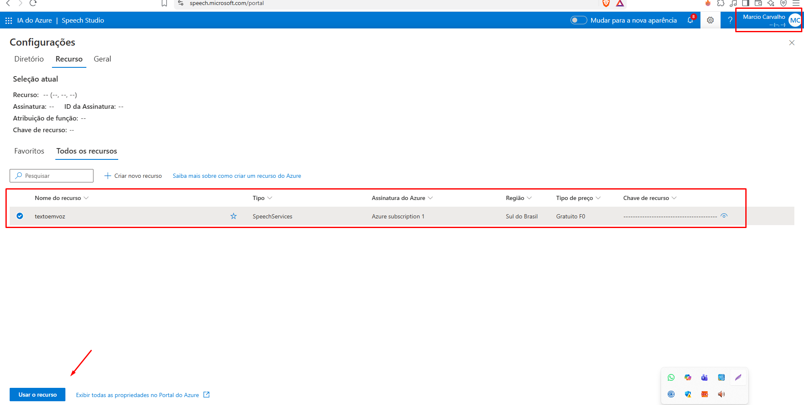
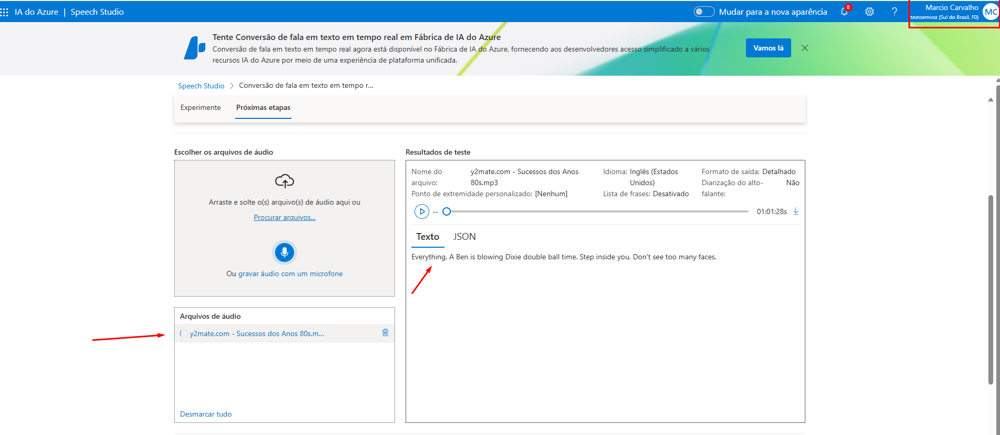
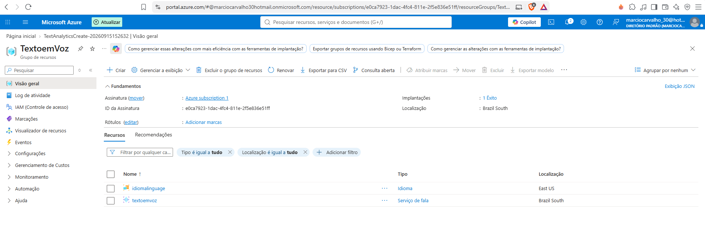
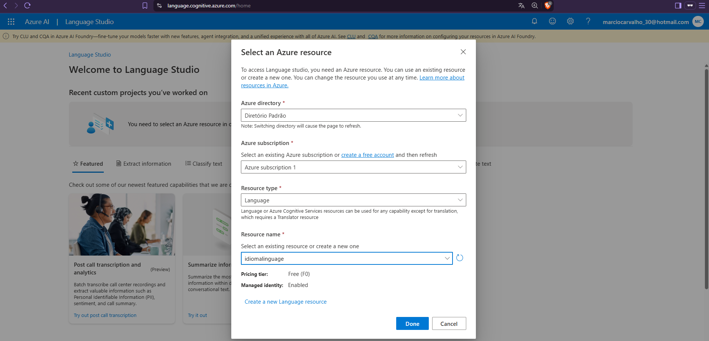
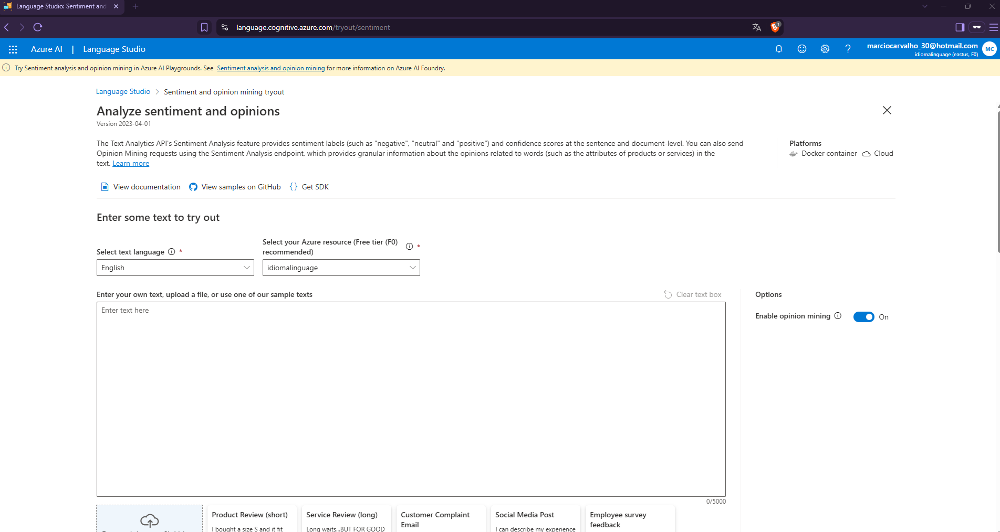
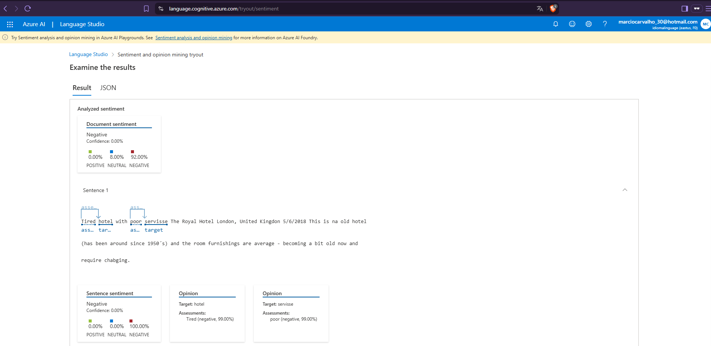

# dio-projeto-azure-ia
# Explorando os Serviços de IA de Voz e Linguagem da Azure

Este repositório contém a documentação prática desenvolvida para o desafio de laboratório do curso de Inteligência Artificial da **DIO (Digital Innovation One)**. O objetivo deste projeto é explorar e aplicar as funcionalidades dos serviços **Azure Speech Studio** e **Azure Language Studio**, documentando os processos, análises e aprendizados adquiridos.

---

## 🛠️ Ferramentas Utilizadas

- **Microsoft Azure Speech Studio:** Ferramenta baseada em nuvem para conversão de fala em texto (Speech-to-Text), texto em fala (Text-to-Speech) e tradução de áudio.
- **Microsoft Azure Language Studio:** Serviço cognitivo para Análise de Sentimentos, Extração de Entidades Nomeadas (NER), Resumo de Texto e Classificação de Linguagem Natural.
- **GitHub:** Utilizado para hospedagem, versionamento e compartilhamento da documentação técnica.

Links: [Azure Speech Studio](https://speech.microsoft.com/portal)
/ [Azure Language Studio](https://language.cognitive.azure.com)

---

## 🎙️ 1. Testes Práticos no Azure Speech Studio

Durante os testes na plataforma **Speech Studio**, foram executadas as seguintes rotinas:

### A. Conversão de Fala para Texto (Speech-to-Text)
- **Cenário do Teste:** Upload de um arquivo de áudio curto em formato `.wav`/`.mp3` contendo uma narração em português.
- **Resultado Obtido:** A ferramenta realizou a transcrição com alta precisão, identificando corretamente pontuações e termos técnicos.
- **Insights:** A transcrição em tempo real demonstrou baixa latência, sendo ideal para criação de legendas automáticas ou transcrição de chamadas de atendimento.

*Segue as imagens para visualização da atividade no Speech Studio*

---

## 🧠 2. Testes Práticos no Azure Language Studio

No **Language Studio**, explorou-se o processamento de linguagem natural (NLP) aplicado a um texto contendo feedback de cliente. (Análise de sentimentos) 

### A. Análise de Sentimentos e Opiniões (Sentiment Analysis)
- **Texto de Entrada:** *"O atendimento do suporte foi excelente e muito rápido, porém o aplicativo móvel ainda apresenta algumas travadas ao fazer login."*
- **Resultado:**
  - **Sentimento Geral:** Misto (Mixed)
  - **Trecho 1 (Atendimento):** Positivo (98% de confiança)
  - **Trecho 2 (Aplicativo):** Negativo (85% de confiança)
- **Insights:** A ferramenta consegue segmentar sentenças dentro de um mesmo parágrafo, permitindo que empresas identifiquem pontos fortes e gargalos em avaliações de usuários de forma granular.

### B. Reconhecimento de Entidades Nomeadas (NER)
- **Resultado:** Identificação automática de datas, locais, nomes de organizações e produtos dentro do texto analisado.

*Segue as imagens do processo realizado com Language studio*

---

## 📑 3. Conclusão e Aplicações no Mundo Real

A combinação dos serviços de **Voz (Speech)** e **Linguagem (Language)** da Azure possibilita a construção de ecossistemas completos de IA, tais como:

1. **Atendimento ao Cliente (Call Centers):** Transcrição automática de chamadas telefônicas em tempo real (Speech-to-Text) seguida de Análise de Sentimentos (Language Studio) para classificar a satisfação do cliente.
2. **Acessibilidade:** Conversão dinâmica de artigos digitais em áudio nativo usando vozes neurais personalizadas.
3. **Automação de Suporte (Chatbots Inteligentes):** Processamento e interpretação da intenção do usuário para respostas mais humanas e precisas.

---

## ✒️ Autor

Desenvolvido por **Marcio Gomes Carvalho **  

## 📫  Vamos Conectar

